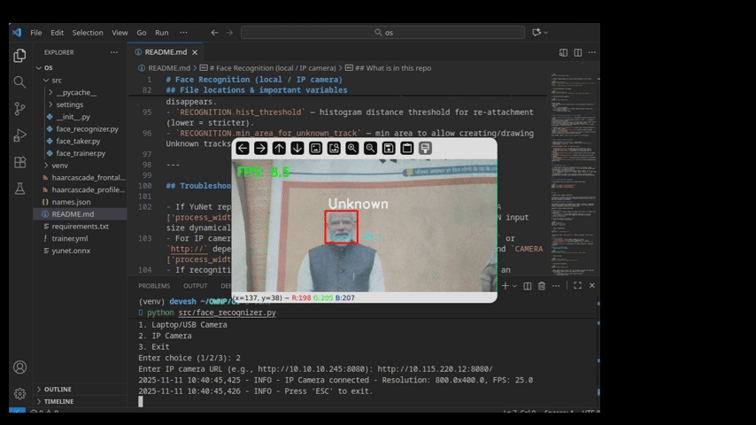

# Face Recognition (local / IP camera)



This repository provides a small, practical pipeline to capture faces, train a simple recognizer, and run a real-time tracker/recognizer using OpenCV.

Repository: https://github.com/Shivanshu49

## What is in this repo
- `src/face_taker.py` — capture labeled face images from a local or IP camera (with optional augmentation).
- `src/face_trainer.py` — train the LBPH recognizer and write `trainer.yml`.
- `src/face_recognizer.py` — real-time detection, recognition, IoU+Kalman tracking, and simple appearance re-ID.
- `settings/settings.py` — central configuration for camera, detection, and recognition parameters.

---

## Quick start (step-by-step, zsh)

1) Create and activate a virtual environment (recommended):

```bash
python -m venv venv
source venv/bin/activate
pip install --upgrade pip
```

2) Install dependencies:

```bash
pip install -r requirements.txt
```

If you don't have `requirements.txt`, install the minimal set:

```bash
pip install opencv-python numpy
```

3) Capture labeled images for a person using the webcam or an IP stream:

```bash
python src/face_taker.py
# Follow the interactive prompts: enter the name/id and move in front of the camera.
# Aim for ~20-80 images per person for the LBPH trainer.
```

4) Train the LBPH model from images:

```bash
python src/face_trainer.py
# This writes a trainer file (trainer.yml) and a names.json mapping.
```

5) Run the real-time recognizer:

```bash
python src/face_recognizer.py
```

During runtime:
- The script may ask for a camera source (0 for local webcam, or paste an IP stream URL).
- Keys:
  - `ESC` — exit the program
  - `l` — lock the nearest track to center (manual override to ensure the correct person is locked)
  - `u` — unlock the nearest track

---

## How to test for the "box sticks to a cup" problem

1) Start `python src/face_recognizer.py` and position a person in front of the camera.
2) Confirm the face is recognized/locked (green box). Press `l` if needed to force-lock the correct person.
3) Have the person briefly look away or turn their head; observe whether the box follows the person (expected) or slips to a nearby object (cup).
4) If a cup or background object gets tracked as an `Unknown` box, try these quick fixes in `settings/settings.py`:

- Increase `min_area_for_unknown_track` to ignore small spurious detections (e.g., set to 2000 or higher).
- Lower `hist_threshold` (e.g., 0.4 -> 0.3) to require stronger histogram similarity for re-attachment.
- Reduce `locked_grace_seconds` if locks are too sticky, or increase if the box drops too quickly when the person briefly looks away.

After change, restart `python src/face_recognizer.py` and re-check.

---

## File locations & important variables

- Images collected by `face_taker.py` → `images/<name>/...`
- Trained model → `trainer.yml` (check `settings/PATHS['trainer_file']`)
- Names mapping → `names.json`

Key tuning parameters (open `settings/settings.py`):

- `RECOGNITION.history_len` — how many past votes to keep for a track.
- `RECOGNITION.confirm_votes` — votes needed to confirm a label and lock.
- `RECOGNITION.forget_timeout` — seconds before an unconfirmed track is forgotten.
- `RECOGNITION.forget_timeout_locked` — timeout used for locked tracks (longer persistence).
- `RECOGNITION.locked_grace_seconds` — seconds of grace when person briefly disappears.
- `RECOGNITION.hist_threshold` — histogram distance threshold for re-attachment (lower = stricter).
- `RECOGNITION.min_area_for_unknown_track` — min area to allow creating/drawing Unknown tracks.

---

## Troubleshooting & tips

- If YuNet reports input-size or deployment errors, try lowering `CAMERA['process_width']` in `settings/settings.py` or let the code set the DNN input size dynamically (it already attempts to).
- For IP cameras: make sure the stream URL is correct, and use `rtsp://` or `http://` depending on camera. If it's choppy, reduce `CAMERA['fps']` and `CAMERA['process_width']`.
- If recognition is unstable across large pose changes, consider adding an embedding-based re-ID model; color histograms are a fast but limited heuristic.

---

## Run a quick syntax check (optional)

To check Python files for syntax errors (helpful after edits):

```bash
python -m py_compile src/face_recognizer.py
python -m py_compile src/face_taker.py
python -m py_compile src/face_trainer.py
```

---

## Links

- GitHub: https://github.com/Shivanshu49

If you want, I can add a short GIF or demo script that exercises the lock/unlock flow and prints per-track diagnostics (histogram distances and vote counts) to help tune thresholds interactively.

# Face Recognition (local / IP camera)

This repository contains a lightweight face capture / training / recognition pipeline using OpenCV (YuNet + Haar cascade + LBPH), with a small IoU+Kalman tracker and appearance histogram re-identification.

Repository: https://github.com/Shivanshu49

## What this does
- `face_taker.py` — capture labeled face images from a local or IP camera (with augmentation).
- `face_trainer.py` — train the LBPH recognizer and write `trainer.yml`.
- `face_recognizer.py` — real-time recognition with detection fallback, tracking, and persistence.

## Quick environment setup (Linux / zsh)
1. Create a virtualenv (recommended):

```bash
python -m venv venv
source venv/bin/activate
pip install --upgrade pip
```

2. Install dependencies:

```bash
pip install -r requirements.txt
```

(If you do not have `requirements.txt`, install at minimum: `opencv-python`, `numpy`.)

## Files of interest
- `src/face_taker.py` — run to capture images for a person.
- `src/face_trainer.py` — run to train the LBPH model from `images/`.
- `src/face_recognizer.py` — real-time recognition. Uses `trainer.yml` and `names.json`.
- `settings/settings.py` — configuration for camera, detection, recognition parameters.

## How to use (step-by-step)
1. Capture faces for a person:

```bash
python src/face_taker.py
# follow prompts to enter a name/id and collect ~20-80 images
```

2. Train the model:

```bash
python src/face_trainer.py
# produces trainer.yml in PATHS['trainer_file']
```

3. Run real-time recognizer:

```bash
python src/face_recognizer.py
```

- Choose camera source (local or IP). For IP cameras, provide the stream URL.
- The recognizer supports these key commands while running:
  - `ESC` — exit
  - `l` — lock nearest track to center (manual override)
  - `u` — unlock nearest track

## How the tracker avoids false positives
- Unknown predictions no longer produce a new track unless the detection area is large enough or the Haar cascade confirms a face inside the ROI. This reduces boxes on background noise.
- Confirmed tracks are given a short "grace" when the user looks away; tune `locked_grace_seconds` in `settings/settings.py`.

## Tuning
Open `settings/settings.py` and adjust under `RECOGNITION`:
- `history_len` — votes history length
- `confirm_votes` — number of votes to confirm a label
- `forget_timeout` — seconds before forgetting an unconfirmed track
- `forget_timeout_locked` — multiplier for locked tracks
- `locked_grace_seconds` — grace when user looks away
- `hist_threshold` — appearance histogram threshold (lower = stricter)
- `min_area_for_unknown_track` — prevents tiny Unknown detections from creating tracks

## Troubleshooting
- If YuNet fails with input-size mismatch, ensure the frame `process_width` in `settings` matches your camera frames (or the code sets input size dynamically).
- If IPCamera is choppy, lower `CAMERA['process_width']` and `CAMERA['fps']` in settings.
- For improved long-term re-ID across large pose changes, consider integrating a small face-embedding model (e.g., a lightweight MobileFaceNet) — this repo currently uses color histograms as a fast heuristic.

## License & Links
- GitHub: https://github.com/Shivanshu49

